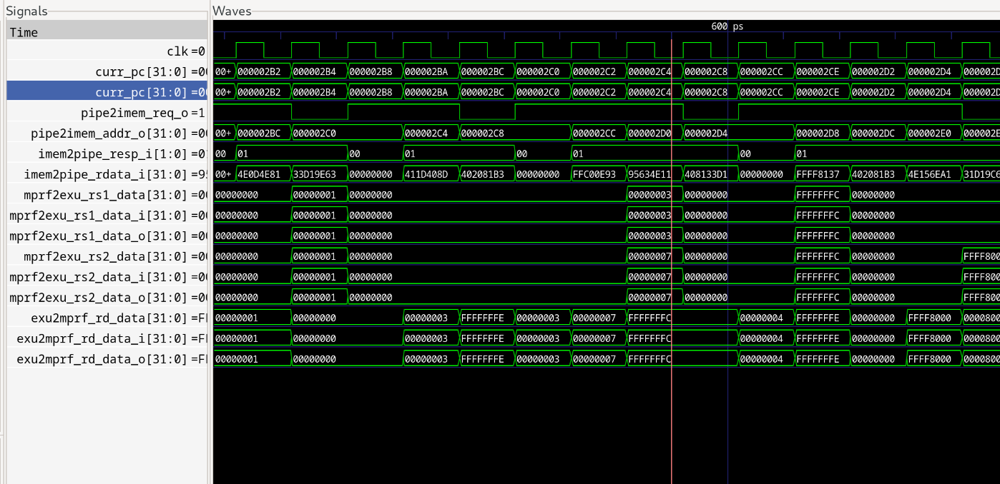

# вывод отладочного модуля

```
=== DETECTED SUB COMMAND ===
--- Machine Information Registers --- 
MVENDORID: 00000000000000000000000000000000
MARCHID: 00000000000000000000000000001000
MIMPID: 00100010000000010001001000000000
mhartid: 0x00000000000000000000000000000000
--- Machine Trap Setup --- 
mstatus: 0x00000000000000000001100010000000
MISA: 0x01000000000000000001000100000100
mie: 0x00000000000000000000000000000000
--- Machine Trap Handling --- 
mepc: 0x00000000000000000000001010100000
mip: 0x00000000000000000000000010000000
--- Other Info --- 
imem_rdata: 0x402081b3
imem_resp: 0x1
curr_pc: 0x000002bc
=================================
```

Теперь найдем на PC `0x000002bc`


# скрин с wave формой на которой отражено выполнение команды SUB


## **0x0003(rs1_data) - 0x0007(rs2_data) = 0xfffc(rd_data)**

Видно, что сначала адреса появляются в *pipe2imem_addr*, и только через пару тактов появляются в *curr_pc*.




